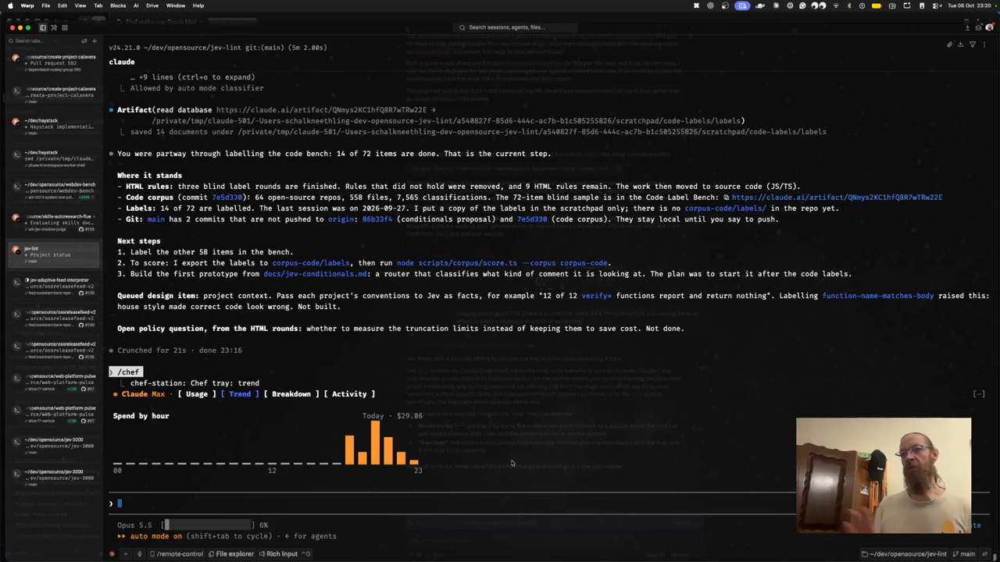

# Chef Station

A Claude Code mod that puts a chef station tray directly above your prompt, so you can keep an eye on the kitchen without leaving the session. The repository is called `claude-chef`, but the plugin is named `chef-station` because Claude Code reserves plugin names that begin with `claude-`.

## See it in action

[](docs/chef-station-demo.mp4)

[Watch the demo video](docs/chef-station-demo.mp4) (50 seconds, with narration). It shows the tray in a Claude Code session as `/chef` moves through each station in turn: Usage, with the plan's rate limits, today's spend and the current session; Trend, with today's spend by hour; Breakdown, with spend by model and by project; and Activity, with thirteen weeks of tokens per day.

## Stations

The tray has four stations. Press the button for a station, or focus the tray with `ctrl+x tab` and press its number. You can also type `/chef <station>`, or just `/chef` to cycle to the next one. The tray remembers the station you picked across sessions. `/chef backfill` rescans your Claude Code history.

1. **Usage** shows your plan's rate-limit windows (the five-hour session and the week) with their reset countdowns, what today has cost in API value along with the token count and the share served from cache, and a "Now" row for the current session: the project, the model, the tokens written, the session cost, how full the context window is, and a stopwatch for the running turn (once the turn ends, it shows how long the turn took).
2. **Trend** draws today's spend hour by hour.
3. **Breakdown** ranks today's spend by model and by project.
4. **Activity** draws a thirteen-week heat map of tokens per day, with the total, the number of active days, the busiest day and your current streak.

## Where the numbers come from

The rate-limit windows, the session cost and the context fill come straight from Claude Code (`$.session.usage()`), so they match the status line and `/cost`. Rate-limit windows only appear on a subscription and only after the first reply of a session.

Today's spend, the trend, the breakdown and the activity grid come from two sources that the tray adds together.

The first is what the mod records live. Each time a turn completes, in the main conversation or in a subagent, the mod records the session cost added since the previous turn, along with the tokens the turn reported, the model that answered and the project. Every session stores its turns under a store key of its own (`turns:<session id>`), and the tray adds all of them up when it reads them, so two sessions running at the same time never overwrite each other's turns. The tray picks up other sessions' spending once a minute, and sessions older than thirteen weeks are removed. The cost attributed to each model is an approximation: when a subagent runs, the parent's requests made before the subagent finished are counted against the subagent's model.

The second is a backfill from the session transcripts Claude Code keeps in `~/.claude/projects` (or `$CLAUDE_CONFIG_DIR/projects`). The backfill reads the last thirteen weeks, a few seconds after the first session of each day starts, and again whenever you run `/chef backfill`. It leaves out every session the tray has already recorded live, so nothing is counted twice. Each response appears on several lines of a transcript, so the backfill counts each response once by its message and request IDs. Transcripts hold token counts but no cost, so the backfill estimates cost from first-party API list prices, including the separate rates for cache reads, five-minute and one-hour cache writes, and fast mode. Those prices live in `hooks/transcript.mjs`. A model with no known price still counts its tokens, and `/chef backfill` names it.

A mod can only read files of up to 4 MiB, and long sessions write larger transcripts. So when Node is installed, the mod runs the helper script `scripts/backfill.mjs`, which streams files of any size and prints the tally as JSON. Without Node, the mod reads the transcripts itself and skips the large ones, and `/chef backfill` says how many it skipped. A transcript that cannot be read at all, for example because it was removed during the scan, adds nothing rather than part of its usage, and `/chef backfill` reports the backfill as incomplete and says how many transcripts were affected. The helper also works on its own, which is handy for checking the numbers:

```sh
echo '[]' | node scripts/backfill.mjs --projects ~/.claude/projects
```

The JSON array on standard input lists session IDs to leave out.

Claude Code does not tell plugins which plan you are on, so the plan badge is a setting. Set it in `/config` under the `chef-station` rows, for example to `Max 5×`, or leave it empty to hide the badge.

## Install

At the prompt of a Claude Code terminal session, run:

```
/plugin install chef-station --marketplace schalkneethling/claude-chef
```

Answer `y` to add the marketplace, then pick a scope. The user scope makes the tray appear in every session.

## Develop locally

Load the mod straight from your clone for a single session:

```sh
claude --plugin-dir /path/to/claude-chef
```

Claude Code watches the folder in an interactive session, so saving a file reloads the mod. The ledger and the selected station survive a reload. Run with `claude --debug` to see why a hook was skipped or a drawing was refused.

To test the marketplace install flow against your working copy instead of GitHub, add the folder as a marketplace and install from it. Edits are then picked up with `/reload-plugins`:

```sh
claude plugin marketplace add /path/to/claude-chef
claude plugin install chef-station@chef-station
```

## Check and test

```sh
claude plugin validate .
claude plugin test .
```

`validate` reads the manifest, the marketplace file and the hooks module the way Claude Code will. `test` runs the `tests/*.test.ts` files against the engine. `format.test.ts`, `ledger.test.ts` and `transcript.test.ts` cover the pure formatting, bookkeeping, transcript parsing and pricing. `register.test.ts` mounts the tray on the terminal and desktop surfaces with a stubbed session, clock, store and helper script.

Once Claude Code has loaded the mod from your folder it writes its type declarations to `.claude-plugin/types/`, and `npx tsc -p .` type-checks the mod against them.
